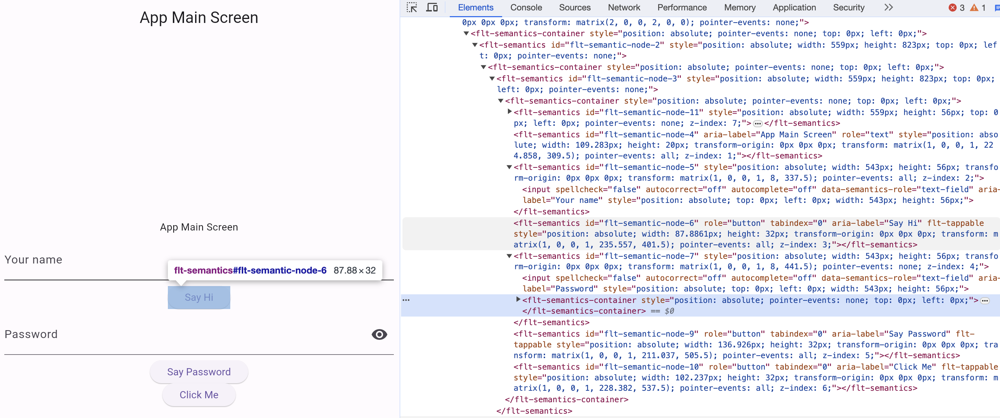

# Flutter Selenium Bridge

## Overview
Flutter Selenium Bridge is an NPM package designed to empower developers and QA engineers with the ability to conduct comprehensive UI testing on Flutter Web applications that are compiled with the CanvasKit renderer. 

This package specifically focuses on enabling Selenium WebDriver to interact with and test the UI elements of deployed Flutter applications, which are traditionally inaccessible to automation tools due to CanvasKit's rendering approach.

While it does not aim to replace Flutter's own integration testing framework, it offers a complementary approach that is particularly useful for validating the deployed application in real-world scenarios.

Flutter Selenium Bridge allows QA engineers to adopt Selenium for creating UI tests without requiring in-depth knowledge of Flutter's internals. This package simplifies the process of enabling Selenium to work with Flutter Web applications, making it accessible for teams to implement automated UI testing for their deployed applications.

## Key Features
- **Selenium WebDriver Integration:** Facilitates the integration of Selenium WebDriver, allowing for automated browser testing of Flutter Web applications.
- **CanvasKit Renderer Compatibility:** Ensures that UI elements rendered as a single canvas by the CanvasKit renderer are made accessible for Selenium-based testing.
- **Streamlined Testing Workflow:** Provides a simplified setup process, enabling developers to quickly begin writing and running Selenium tests on their Flutter applications.

## Manual Accessibility Activation

The `enableAccessibility()` method provided by Flutter Selenium Bridge automates the process of making Flutter web elements accessible to Selenium by simulating a click on a hidden button that populates the DOM tree with semantic placeholders.

To understand how this works and to aid in identifying the correct locators for your tests, it's important to know how to replicate this process manually:

1. Open your Flutter web application in a browser.
2. Open the Developer Tools (you can do this by right-clicking on the page and selecting "Inspect" or by pressing `Ctrl+Shift+I` on Windows/Linux or `Cmd+Option+I` on macOS).
3. Go to the "Console" tab within the Developer Tools.
4. Paste and execute the following script:
   ```javascript
   document.querySelector('flt-glass-pane').shadowRoot.querySelector('flt-semantics-placeholder').click();
   ```

This script clicks the hidden flt-semantics-placeholder button, which triggers the population of the DOM tree with UI elements, making them accessible for testing.



By performing this action manually, you can verify that the DOM tree of your Flutter web application is correctly populated. This is a crucial step for effectively using the Flutter Selenium Bridge package, as it ensures that you can find and interact with the Flutter elements during your testing.

Once you have confirmed that you can manually populate the DOM tree and identify elements, you can proceed to use the automated enableAccessibility() method provided by the package in your test scripts.


## Installation
To install Flutter Selenium Bridge, run the following command:

1. **Install the package:**
   ```sh
   npm install flutter-selenium-bridge --save-dev
   ```

## Usage
After installation, you can import FlutterSeleniumBridge in your test files and use it to interact with your Flutter Web application:

   ```javascript

   const { FlutterSeleniumBridge } = require('@rentready/flutter-selenium-bridge');
   // Or, if using ES6 imports
   import { FlutterSeleniumBridge } from '@rentready/flutter-selenium-bridge';

   // Your test code here
   ```

### Enabling Accessibility
To interact with UI components rendered by Flutter's CanvasKit renderer, you need to enable accessibility first. This allows Selenium to recognize and interact with the components as if they were standard HTML elements.

```javascript
const { Builder } = require('selenium-webdriver');
const { FlutterSeleniumBridge } = require('@rentready/flutter-selenium-bridge');

(async () => {

  const driver = await new Builder()
    .forBrowser('chrome')
    .build();

  const bridge = new FlutterSeleniumBridge(driver);
  await driver.get('http://127.0.0.1:8000'); // Replace with your Flutter Web app URL
  await bridge.enableAccessibility();
})();
```

### Activating Input Fields
If you need to set values in input fields within your Flutter Web application, use the activateInputField method before. This method ensures that the input field is ready to receive text input.

```javascript


(async () => {
  // ... (after initializing driver and bridge, and navigating to your web app)
  const nameInputXPath = '//flt-semantics[@id="flt-semantic-node-5"]/input';
  const nameInput = await bridge.activateInputField(By.xpath(nameInputXPath));
  await nameInput.sendKeys('Your Name');
})();
```

### Interacting with Elements
Once accessibility is enabled, you can interact with elements on the page using standard Selenium methods.

```javascript
(async () => {
  // ... (after enabling accessibility)
  const buttonXPath = '//flt-semantics[contains(@aria-label, "Click Me")]';
  const clickMeButton = await driver.findElement(By.xpath(buttonXPath));
  await clickMeButton.click();

  // Verify that the expected response appears
  const responseXPath = '//flt-semantics[contains(@aria-label, "You clicked me")]';
  const responseLabel = await driver.findElement(By.xpath(responseXPath));
  // ... (assertions or further interactions)
})();
```

Remember to replace the XPath selectors with those that match the elements in your specific Flutter Web application.

## Contributing
We welcome contributions to the Flutter Selenium Bridge project. If you have suggestions or improvements, please submit a pull request or open an issue on our [GitHub repository](https://github.com/rentready/flutter-selenium-bridge).

## License
This project is licensed under the MIT License - see the [LICENSE](./LICENSE) file for details.